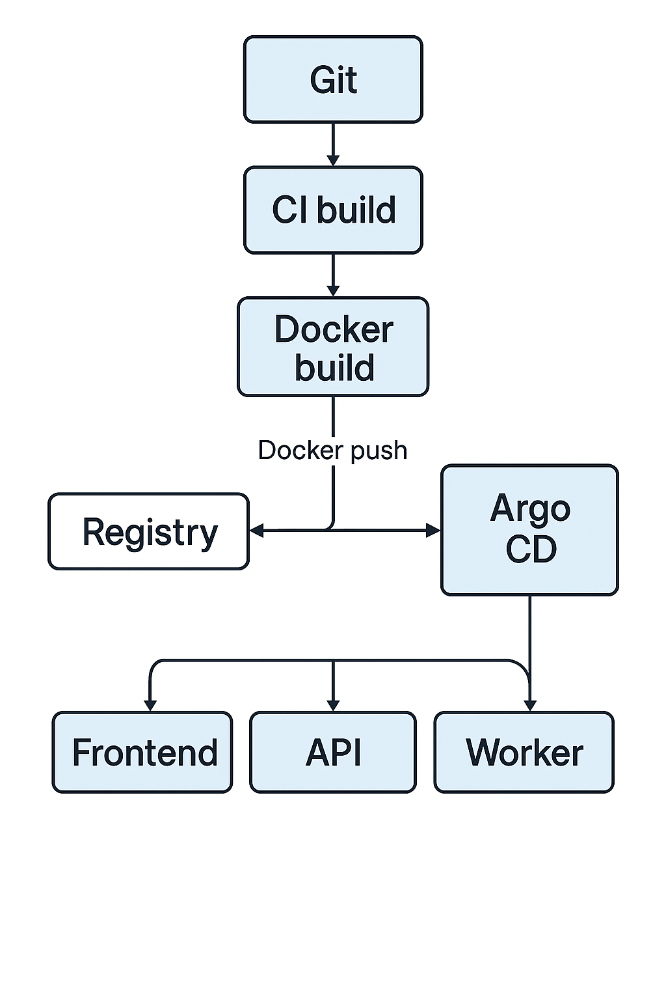

# Prod-Preview

A simple “preview” environment for a microservices app, built on AWS EKS with a GitOps workflow. It lets you test your React frontend, Node.js API, and Python worker together in a staging namespace - so you can catch issues in a production-like cluster before going live.

## What’s Inside

- **api/**  
  A Node.js + Express service with health and sample endpoints.
- **frontend/**  
  A React + Vite app that shows your UI and pings `/health.json`.
- **worker/**  
  A Python background job for async tasks.
- **infra/terraform/**  
  Terraform code to spin up VPC, RDS (Postgres), and an EKS cluster with nodes.
- **infra/helm/**  
  Helm charts for each service plus an umbrella chart to deploy them all at once.
- **infra/argocd/**  
  An Argo CD Application manifest to wire up GitOps.

## How It Works

1. **Terraform** creates your AWS network, database, and EKS cluster.  
2. **Docker** builds images for each service and pushes them to Docker Hub.  
3. **Helm** packages those images into charts and deploys them into a `staging` namespace.  
4. **Argo CD** watches the Git repo and automatically applies any chart changes—no manual `kubectl` or `helm` needed.

## More Details Coming Soon!
